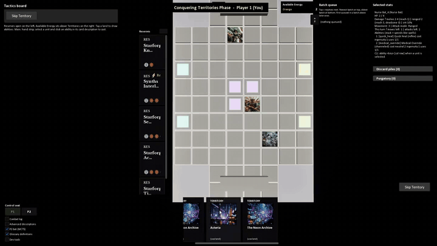

# Gridlock Tactics

This is a work in progress prototype for a multiplayer tactical card game me and my friends are making. Of course they wanted the comp sci major to actually program everything while they think of "ideas" nevertheless its going sort of smoothly even if the UI is kind of a mess.

## Preview



## Architecture

The true purpose of this is to eventually integrate it with some sort of real world smart board, where it can register game and smart pieces straight to the software with websockets(change sofware_
Technically its not actually made with c++ unreal objects but it is a separate c++ module loaded into whats effectively a GUI. The C++ standaolone is meant to be able to create small portable servers with micro ccomputers. It can also just work standalone with unreal with a 3d board gui visual. Currrently there is a board and a battle visualization however the art assets are currently all place holders.. Unreal works by effectively sending cmds lines to its own running c++ instance with the 3d board gui/

# Instructions

If you want to actually try this game, (i don't think its fully stable yet, the c++ is fine but the unreal gui still needs a lot of polishing) you will need Unreal Engine 5.8.

## Unreal

Open `TacticsGameUnreal 5.8/TacticsGameUnreal.uproject` and press Play.

- Play vs AI
- Host LAN / Join (default port 8788)

To rebuild the editor (`build_ue.bat` expects the engine at `E:\UE_5.8`, change that path if yours is somewhere else):

```
.\build_ue.bat
```

## Packaged build

```
.\scripts\package_win64_desktop.ps1
```

Then run `Packaged\Win64\TacticsGameUnreal.exe`. That output stays on your machine, it is not in this repo.

## C++ server

I don't really recommend this for actually playing. It's meant to eventually have a web gui talk to it (and later the smart board). If you just want a match, use Unreal Host LAN.

If you still want the headless host:

```
.\build_standalone.bat
.\run_net_server.bat
```

That builds `tactics_net_server` if it isn't there yet and loads cards from `TacticsGameUnreal 5.8\Content`. In Unreal, Join `ws://127.0.0.1:8788/`.

LAN bind (0.0.0.0):

```
.\run_net_server_lan.bat
```

Extra args go through (`--port 9000`, `--token secret`).

Interactive C++ match with no Unreal at all:

```
.\run_cli.bat
```

Made with C++ and Unreal 5.7/ 5.8
